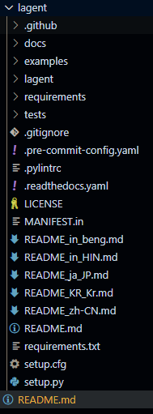
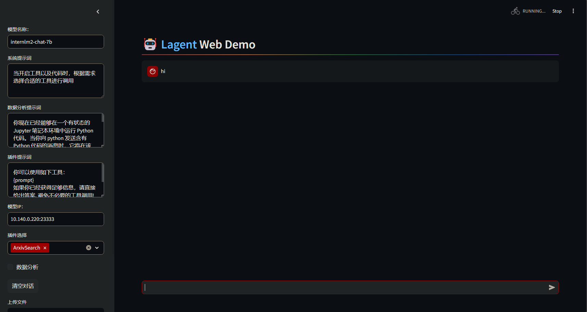

# try-lagent

### Clone the repo.
```bash
git clone https://github.com/InternLM/lagent.git
cd lagent
ls
```



### Create a virtual environment and install dependencies.

```bash
# Linux Specific commands.
python3 -m venv .venv
. .venv/bin/activate
pip install lagent
```

### Run streamlit.

```bash
# pip install streamlit
streamlit run examples/internlm2_agent_web_demo.py
```

Visit the page at http://localhost:8501.

At this moment of time, I am facing an issue as below. Specifically:

```bash
ModuleNotFoundError: No module named 'termcolor'
```

So fixed it using below command:

```bash
pip install termcolor
```

This leads to another error display namely: module lmdeploy not found. Installing it fixes the problem. Not a good experience. A requirements.txt file or installation steps would be helpful.

```bash
pip install lmdeploy
```

Seems to be taking some time on a standard CPU 16GB memory and after sometime threw an error of runtime exception.


